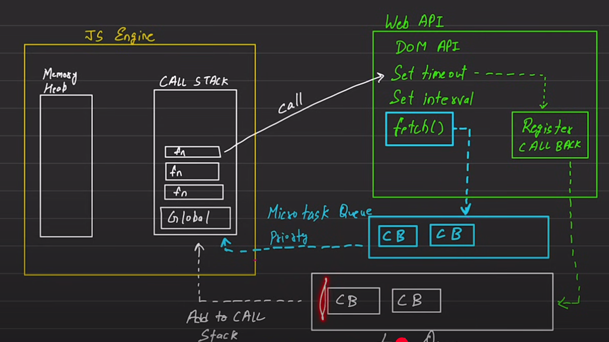
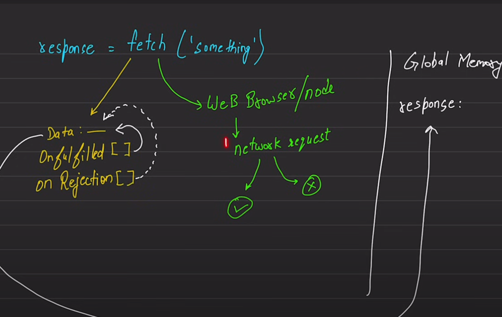

A Promise is a proxy for a value not necessarily known when the promise is created. It allows you to associate handlers with an asynchronous action's eventual success value or failure reason. This lets asynchronous methods return values like synchronous methods: instead of immediately returning the final value, the asynchronous method returns a promise to supply the value at some point in the future.

A Promise is in one of these states:

pending: initial state, neither fulfilled nor rejected.
fulfilled: meaning that the operation was completed successfully.
rejected: meaning that the operation failed\\

/* fetch-->

The Fetch API provides an interface for fetching resources 
(including across the network)
. It is a more powerful and flexible replacement for XMLHttpRequest.

The fetch() method takes one mandatory argument,
 the path to the resource you want to fetch. 
 It returns a Promise that resolves to the Response 
 to that request — as soon as the server responds with 
 headers — even if the server response is an HTTP error status.
  You can also optionally pass in an init options object as the second argument 
  (see Request).

  

  

