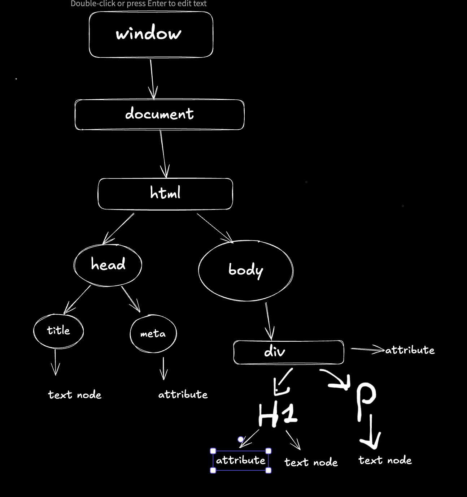

this is diagram to undertan dom in browse

lec2-->

there are 3 4 things like consloe p jake
documnet.getelemnetid('class,id')
const a =documnet.getelemnetid('class,id')

//concept of nodelist in this we can use loops
//html collection there is no loop --> document.getElementsByClassName('title'),
//you have to convert this into array then use mapp and loops -->array.from("xyzzz")

//inner text,html text,textcontent 