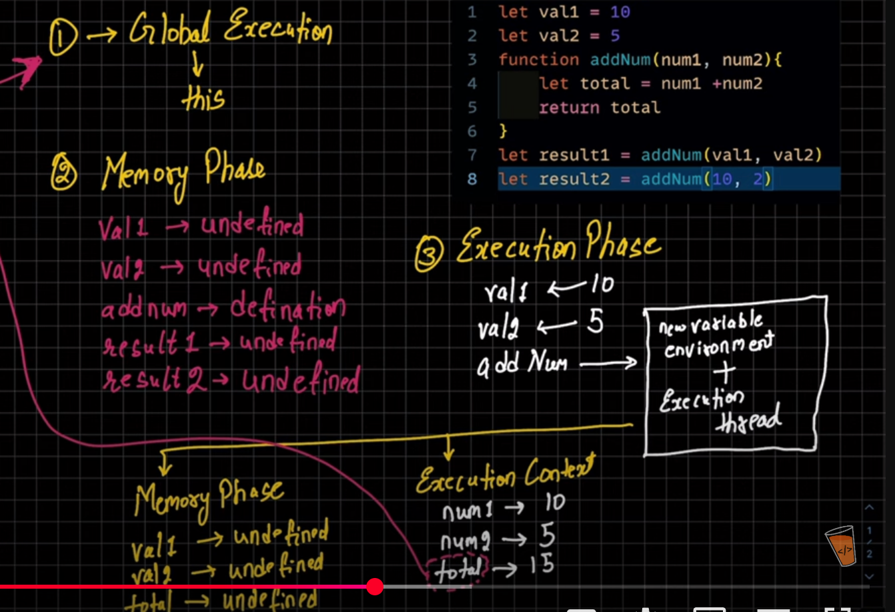
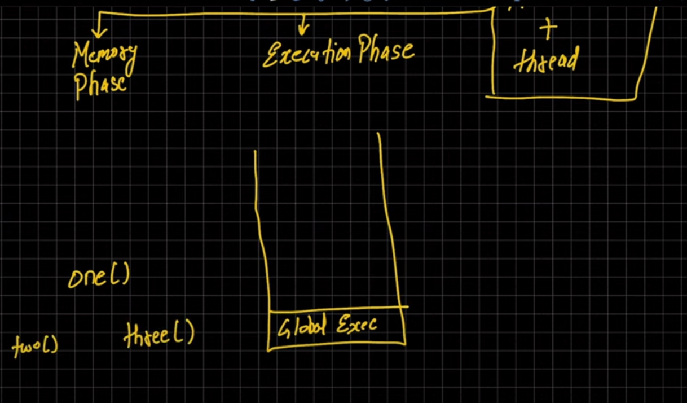
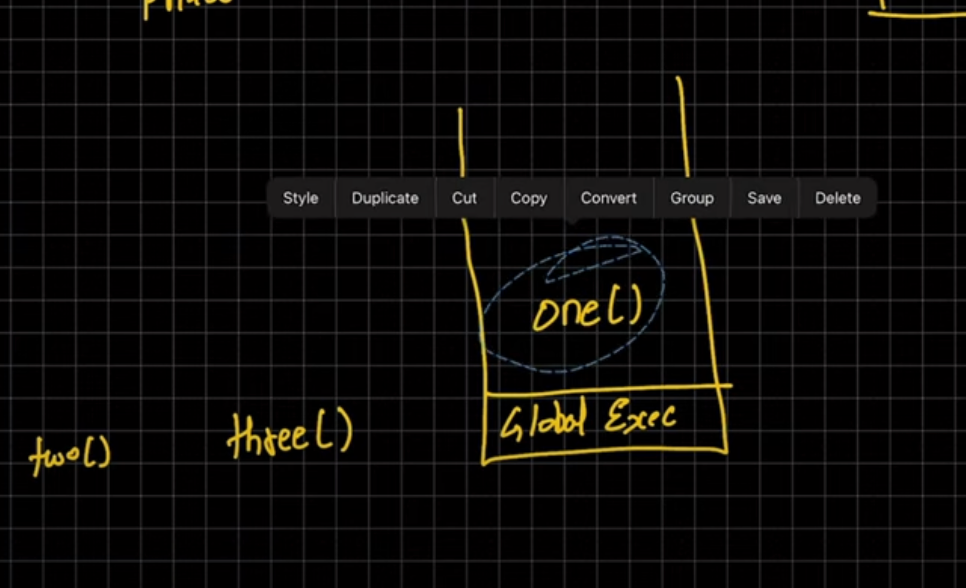
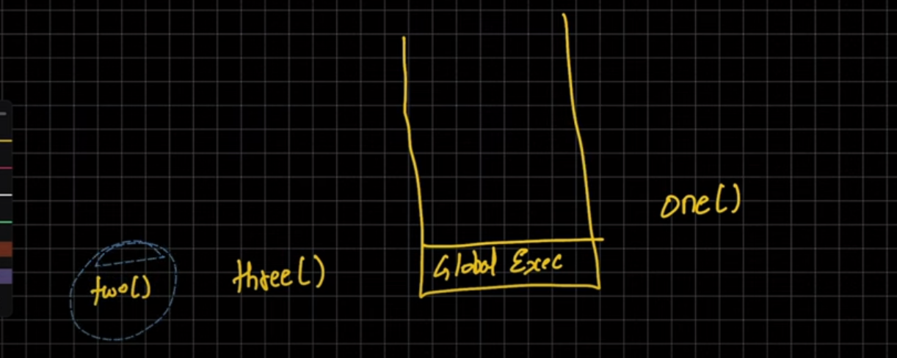
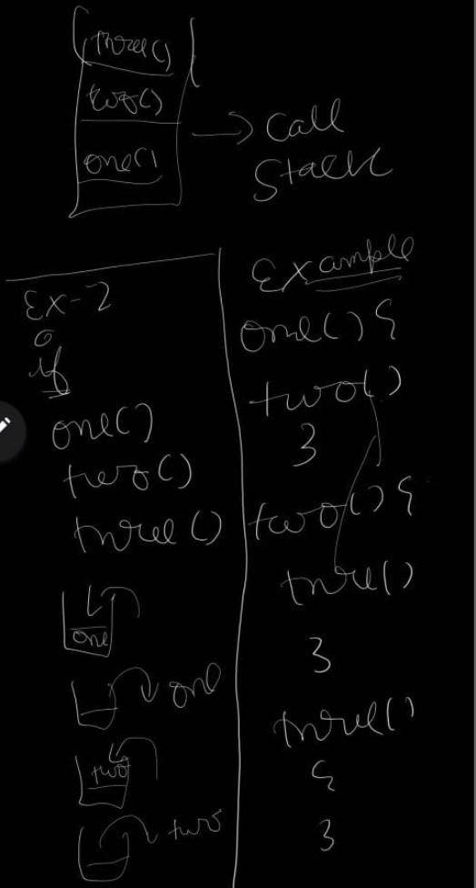

/*

        javascript exceution context

        javacript is single threaded
        ek process p kam krti h 

        main two types exceution
        1--> global (in browser it is window ,gobal excute through "this" key word)
        2-->function exceution context
        3-->eval

        two pahes m run hota h 

        ** {} **
        1--> is memory creation phase  ( creation phase)==> basically varibales ko
        memory allocate krte 

        2--> is "exceution phase" code exceute hota h

        **********************************************
         
example-->
        let val2=20
        let val1=20

        function addtwo(num1,num2)
        {
            let total=num1+num2
            return total
        }

        let result=add(val1,val2)
        console.log(result)

        how it work 
       1. global phase-->("this")

       2. memory phase -->("val1=undefined"
                            result1=undefined
                          , add("defination")) in this pahse 

        3.exceution phase--> 
          val1-->20
          val2-->20

          * jitne bar bhi y naye function bnte h utni bar ek box crete hota h 
             
             box(" new variable enviroment+exceution thread ")
          
          *
          addnum ()

                           

 
 */

 call stack

    -->
   -->
 -->

 interview m pucha jata h **

 call stack-->call stack m function 1 jata  h niklta h 

 